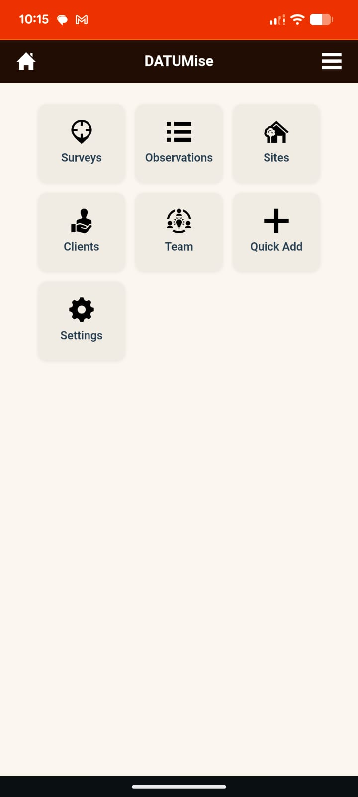
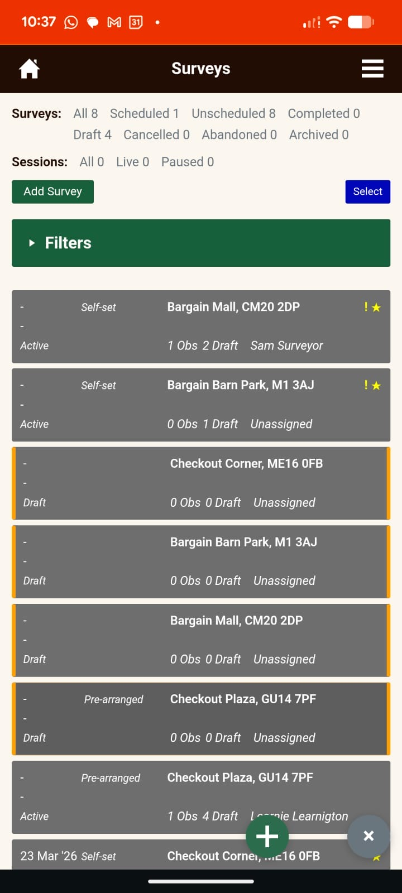
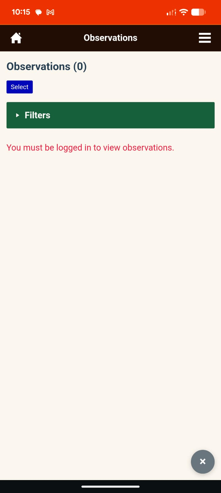
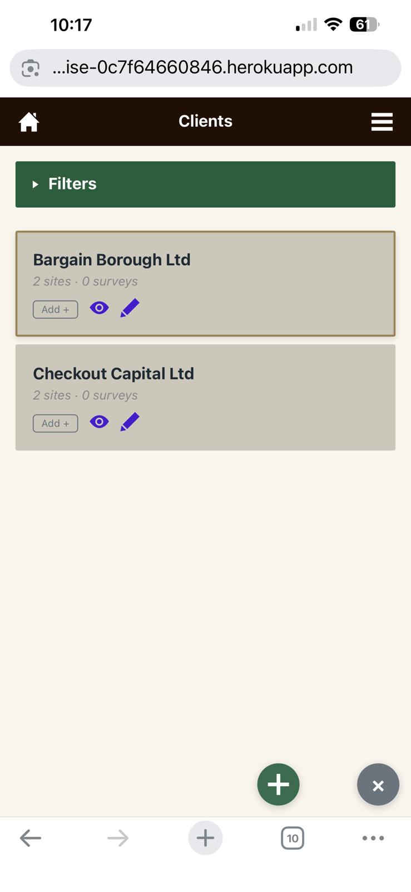
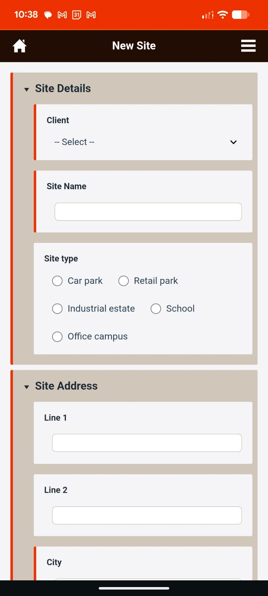
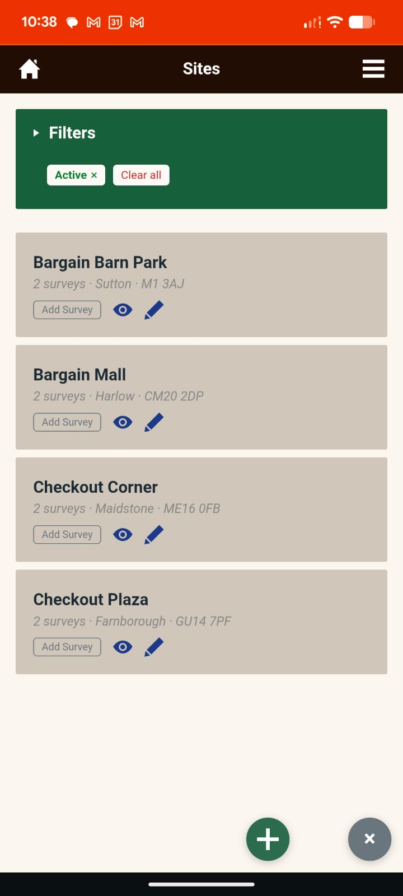

# DATUMise

DATUMise is a mobile-first survey management platform built for surveyors working on site. It enables fast capture of photographic observations, structured survey workflows, session tracking, and team collaboration.

This project was developed as part of **Code Institute Portfolio Project 5 — Advanced Front-End Applications**.

---

## Live Links

- **Front-End:** [datumise-0c7f64660846.herokuapp.com](https://datumise-0c7f64660846.herokuapp.com)
- **API:** [datumise-api-34ac9366a2f9.herokuapp.com](https://datumise-api-34ac9366a2f9.herokuapp.com)

---

## Project Structure

DATUMise is a monorepo containing two applications:

- **datumise-api/** — Django REST Framework API (local development)
- **datumise-react/** — React front-end application
- **posts/** — Django app used by the production Heroku deployment
- **config/** — Django project settings and URL configuration

---

## User Research

Before development began, interviews were conducted with practising surveyors to understand their frustrations with existing survey photo capture tools. The key findings were:

- **Too many dropdown menus** — existing apps forced surveyors through multiple selection screens before they could take a single photo
- **Buttons too small for site conditions** — surveyors wearing gloves or working in poor lighting struggled with fiddly controls
- **Slow workflow** — surveyors wanted to add a photo, write a brief description, tap next, and immediately be ready for the next observation
- **Office follow-up** — surveyors needed to update and refine descriptions back in the office after the site visit, particularly for technical details like root cause analysis
- **Collaboration** — surveyors wanted to view other surveyors' photos and descriptions, and leave comments or queries

These findings directly shaped the core design decisions in DATUMise: large touch-friendly buttons, minimal steps to capture an observation, and a clear separation between on-site capture and office-based review.

### Real Surveyor Feedback

The application was tested by two practising surveyors during development. Their feedback led to a significant change in how sessions work within surveys. In practice, surveys are rarely completed in a single continuous visit. Sessions start and stop due to real-world reasons:

- Access restrictions (waiting for keys, security clearance)
- Clients arriving late or leaving early
- Specialists such as roofers or electricians joining for part of the survey
- Weather conditions forcing a pause
- Lunch breaks or end of working day

This feedback drove the decision to model sessions as separate work activities within a survey, with support for pause, resume, and multiple sessions per survey. The session model reflects how surveyors actually work on site rather than assuming a single uninterrupted visit.

---

## Project Goals

DATUMise provides a platform where surveyors and office teams can:

- Create and manage structured site surveys
- Capture photographic observations on site with minimal steps
- Track survey sessions with automatic start, pause, and completion
- Prepare draft observations before visiting a site
- Collaborate through comments, likes, and observation sharing
- Manage clients, sites, and teams through a consistent interface
- Work efficiently on mobile devices in real-world site conditions

---

## Technologies Used

### Front-End

- React 18 (Create React App)
- JavaScript (ES6+)
- React Bootstrap
- React Router
- CSS3 (responsive, mobile-first)
- Axios (API communication)

### Back-End

- Python 3.12
- Django 4.2
- Django REST Framework
- dj-rest-auth + django-allauth (token-based authentication)
- django-filter (queryset filtering)
- PostgreSQL (Heroku Postgres)
- Cloudinary (image storage via django-cloudinary-storage)
- Gunicorn (production server)
- WhiteNoise (static file serving)

### Tools and Services

- Git and GitHub (version control)
- Heroku (deployment — two separate apps for API and front-end)
- [Iconmonstr](https://iconmonstr.com/) (icons used throughout the UI)
- Chrome DevTools and Firefox DevTools (testing and debugging)
- Jest (automated testing)

---

## Features

### Dashboard

The landing page provides quick access to all areas of the application through tile-based navigation: Surveys, Observations, Sites, Clients, Team, Quick Add, and Settings.



### Survey Management

- Create surveys with structured fields: client, site, visit protocol, working hours, site requirements, procedures, attendees, priority, and deadlines
- Activate surveys when required fields are complete
- Assign surveys to surveyors
- Track survey status: Draft, Active, Completed, Cancelled, Abandoned, Archived
- View survey cards with schedule, session count, observation counts, and surveyor name



### Survey Capture

- Start sessions automatically when a photo is captured
- Pause and resume sessions with countdown timer
- Navigate through observations using forward and back buttons
- Add photos and descriptions to create real observations
- Convert draft observations to real observations by adding a photo and description
- Auto-save draft observations when the screen is closed

### Observation Management

- Create observations with photos and descriptions
- View observations in a structured list with filters
- Select and copy observation text or photos to other surveys
- Like and comment on observations
- Reply to comments for threaded discussion



### Client and Site Management

- Create and manage clients with contact details and billing information
- Create and manage sites with address, type, access notes, and contacts
- View sites grouped by client
- Add surveys directly from site cards




### Team Management

- View team members with roles (Admin, Office, Surveyor)
- Create new team members (admin only)
- Archive users to block system access

### Filters and Search

- Multi-select filters on all list pages (Surveyor, Client, Site, Schedule)
- Search observations and surveys by keyword
- Filter chips with clear all option
- Active status filter on sites

### Session Tracking

- Automatic session start on first photo capture
- Pause with countdown timer and cancel option
- Complete sessions to close the work activity
- Session count and status displayed on survey cards

### Responsive Design

- Mobile-first layout optimised for on-site use
- Floating action buttons (add, return, back-to-top) in horizontal row
- Buttons shrink on scroll to reduce screen clutter
- Stacked form layouts on small screens
- Touch-friendly button sizes for use with gloves



---

## Data Model

### Entity Relationship Diagram

```
┌──────────────────┐
│       User       │
│──────────────────│
│ id               │
│ username         │
│ first_name       │
│ last_name        │
│ email            │
└────────┬─────────┘
         │ 1:1
┌────────▼─────────┐
│     Profile      │
│──────────────────│
│ role             │──── admin | office | surveyor
│ phone            │
│ status           │──── active | archived
└──────────────────┘

┌──────────────────┐       1:N        ┌──────────────────┐
│     Client       │─────────────────▶│   ClientSite     │
│──────────────────│                  │──────────────────│
│ name             │                  │ name             │
│ client_type      │                  │ site_type        │
│ account_manager  │                  │ address_line_1   │
│ contact_name     │                  │ address_line_2   │
│ contact_email    │                  │ city             │
│ contact_phone    │                  │ county           │
│ billing_address  │                  │ postcode         │
│ status           │                  │ contact_name     │
│ is_demo          │                  │ contact_phone    │
└──────────────────┘                  │ contact_email    │
                                      │ access_notes     │
                                      │ status           │
                                      │ is_demo          │
                                      └────────┬─────────┘
                                               │ 1:N
                                      ┌────────▼─────────┐
                                      │     Survey       │
                                      │──────────────────│
                                      │ notes            │
                                      │ status           │──── draft | open | assigned | completed | archived
                                      │ survey_status    │──── draft | active | completed | cancelled | abandoned
                                      │ visit_requirement│
                                      │ scheduled_for    │
                                      │ due_by           │
                                      │ urgent           │
                                      │ closure_reason   │
                                      │ assigned_to ──────────▶ User (FK)
                                      │ created_by ───────────▶ User (FK)
                                      │ is_demo          │
                                      └───────┬──┬───────┘
                                              │  │
                                    1:N       │  │       1:N
                           ┌──────────────────┘  └──────────────────┐
                  ┌────────▼─────────┐                     ┌────────▼─────────┐
                  │  Observation     │                     │  SurveySession   │
                  │──────────────────│                     │──────────────────│
                  │ title            │                     │ session_number   │
                  │ image            │                     │ status           │──── active | paused | completed | abandoned
                  │ is_draft         │                     │ session_type     │──── visit | revisit | review
                  │ owner ────────────────▶ User (FK)      │ started_by ──────────▶ User (FK)
                  │ likes ────────────────▶ User (M2M)     │ started_at       │
                  │ is_demo          │                     │ ended_at         │
                  └────────┬─────────┘                     └──────────────────┘
                           │ 1:N
                  ┌────────▼─────────┐
                  │    Comment       │
                  │──────────────────│
                  │ content          │
                  │ owner ────────────────▶ User (FK)
                  │ parent ───────────────▶ Comment (FK, self-referencing)
                  │ likes ────────────────▶ User (M2M)
                  │ created_at       │
                  └──────────────────┘
```

### Survey Lifecycle

```
Draft → Active → Completed
                → Cancelled
                → Abandoned
                → Archived
```

### Session Lifecycle

```
Active → Paused → Active (resume)
       → Completed
       → Abandoned
```

### Key Relationships

- A **Client** has many **Sites**
- A **Site** has many **Surveys**
- A **Survey** has many **Observations** and **Sessions**
- An **Observation** belongs to one **Survey** and one **Owner** (user)
- A **Comment** belongs to one **Observation** and supports threaded replies

### Survey Status Fields

| Field | Purpose |
|-------|---------|
| `status` | Core lifecycle state (draft, open, assigned, completed, archived) |
| `survey_status` | Domain status (draft, active, completed, cancelled, abandoned) |
| `survey_record_status` | Archive state (unarchived, archived) |
| `closure_reason` | Why a survey was archived (missed, abandoned, cancelled) |
| `current_session_status` | Active session state (active, paused, null) |

### Observation Fields

| Field | Purpose |
|-------|---------|
| `is_draft` | Whether the observation is a draft or real |
| `image` | Cloudinary image URL |
| `title` | Observation description text |
| `owner` | User who created the observation |

---

## API Endpoints

### Authentication

| Endpoint | Method | Auth | Description |
|----------|--------|------|-------------|
| `/api/auth/registration/` | POST | No | Register new user |
| `/api/auth/login/` | POST | No | Login and receive token |
| `/api/auth/logout/` | POST | Yes | Logout and invalidate token |
| `/api/auth/user/` | GET | Yes | Get current user details |

### Surveys

| Endpoint | Method | Auth | Description |
|----------|--------|------|-------------|
| `/api/surveys/` | GET | Yes | List all surveys (with annotations) |
| `/api/surveys/` | POST | Yes | Create a new survey |
| `/api/surveys/<id>/` | GET | Yes | Retrieve survey with observations |
| `/api/surveys/<id>/` | PATCH | Yes | Update survey fields or status |
| `/api/surveys/<id>/` | DELETE | Yes (Admin) | Delete survey (no sessions or observations) |
| `/api/surveys/<id>/assign/` | POST | Yes (Surveyor) | Self-assign to an open survey |

### Observations

| Endpoint | Method | Auth | Description |
|----------|--------|------|-------------|
| `/api/observations/` | GET | Yes | List observations (drafts excluded unless filtered by survey) |
| `/api/observations/` | POST | Yes | Create observation |
| `/api/observations/<id>/` | GET | Yes | Retrieve single observation |
| `/api/observations/<id>/` | PATCH | Yes (Owner) | Update observation |
| `/api/observations/<id>/` | DELETE | Yes (Owner) | Delete observation |
| `/api/observations/<id>/like/` | POST | Yes | Toggle like on observation |

### Comments

| Endpoint | Method | Auth | Description |
|----------|--------|------|-------------|
| `/api/comments/` | GET | Yes | List comments (filterable by observation) |
| `/api/comments/` | POST | Yes | Create comment |
| `/api/comments/<id>/` | PATCH | Yes (Owner) | Update comment |
| `/api/comments/<id>/` | DELETE | Yes (Owner/Obs Owner) | Delete comment |
| `/api/comments/<id>/like/` | POST | Yes | Toggle like on comment |

### Clients, Sites, and Team

| Endpoint | Method | Auth | Description |
|----------|--------|------|-------------|
| `/api/clients/` | GET, POST | Yes | List or create clients |
| `/api/clients/<id>/` | GET, PATCH, DELETE | Yes | Retrieve, update, or delete client |
| `/api/sites/` | GET, POST | Yes | List or create sites |
| `/api/sites/<id>/` | GET, PATCH, DELETE | Yes | Retrieve, update, or delete site |
| `/api/team/` | GET, POST | Yes (Admin for POST) | List or create team members |
| `/api/team/<id>/` | GET, PATCH | Yes (Admin for PATCH) | Retrieve or update team member |

### Other

| Endpoint | Method | Auth | Description |
|----------|--------|------|-------------|
| `/api/demo-data/` | DELETE | Yes (Admin) | Delete all demo data |

---

## Authentication

This API uses **token-based authentication** via dj-rest-auth.

Header format:

```
Authorization: Token <user_token>
```

Tokens are returned from `/api/auth/login/` and `/api/auth/registration/`.

### Permission Model

| Role | Capabilities |
|------|-------------|
| **Unauthenticated** | No access (all endpoints require authentication) |
| **Surveyor** | Create observations, manage own surveys, self-assign to open surveys |
| **Office** | View all data, cannot edit other surveyors' observations |
| **Admin** | Full access including team management, survey deletion, and demo data |
| **Archived** | Blocked from all API access |

---

## Testing

### Device Testing

The application was tested on the following physical devices:

- **Apple iPhone 13 Pro Max** (iOS, Safari)
- **Google Pixel 9** (Android, Chrome)

Browser DevTools (Chrome and Firefox) were used extensively for responsive testing, debugging network requests, and inspecting layout across breakpoints.

### Automated Testing (Jest)

DATUMise uses Jest to test core business rules that drive survey behaviour, session logic, and data integrity. Rather than attempting full UI testing, the focus is on pure logic functions, ensuring that critical rules behave correctly and consistently.

**Test file:** `datumise-react/src/utils/surveyRules.test.js`

#### What is Tested

**1. Survey Activation Logic**

Tests ensure that a survey can only be activated when all required fields are completed:

- Client
- Site
- Client's site visit protocol
- Survey window
- Client working hours (at least one selected)
- Site requirements
- Site procedures
- Other attendees (including "None")
- Priority

Example: a survey with all required fields returns `true`; a survey missing any field (such as priority) returns `false`.

**2. Session Logic**

Session behaviour is tested to ensure:

- Sessions start only when a real observation (photo) is captured
- Sessions do NOT start from draft observations, copying observations, or navigation actions
- Sessions do not start in Draft surveys

**3. Observation Logic**

Tests verify:

- Correct detection of real observations (non-draft with image present)
- Draft observations remain separate from real observations

**4. Delete Rules**

Tests enforce data protection rules:

- Observations cannot be deleted in Completed surveys
- Sites and Clients cannot be deleted if they contain real observations
- Draft-only data can be deleted safely

**5. Survey Copy Logic**

Tests verify that copied surveys correctly clear transient fields:

- Clears survey date, assigned surveyor, attendees, deadline, and notes
- Sets status to draft
- Preserves site and visit requirement

**6. Site Copy Logic**

Tests verify site duplication behaviour:

- Same client: renames with "Copy N" suffix, clears address
- Different client: clears client, address, and contact fields

#### Test Results

```
PASS src/utils/surveyRules.test.js

  canActivateSurvey
    ✓ returns true when all required fields complete
    ✓ returns false when client missing
    ✓ returns false when site missing
    ✓ returns false when visit_requirement missing
    ✓ returns false when working_hours missing
    ✓ returns false when arrival_action missing
    ✓ returns false when other_attendees missing
    ✓ returns false when urgent is empty string
    ✓ returns true when urgent is false (explicitly set)

  isOtherAttendeesComplete
    ✓ ["none"] is valid
    ✓ empty array is not valid
    ✓ null is not valid
    ✓ multiple attendees is valid

  isVisitProtocolsComplete
    ✓ requires at least one working hours entry
    ✓ empty object is not complete
    ✓ null is not complete
    ✓ all-falsy entries is not complete
    ✓ boolean true entry is complete

  shouldStartSession
    ✓ starts when survey is active and photo taken
    ✓ starts when survey is open and photo taken
    ✓ starts when survey is assigned and photo taken
    ✓ does not start without photo
    ✓ does not start on draft survey
    ✓ does not start on completed survey

  isRealObservation
    ✓ is_draft=false and image present → true
    ✓ draft observation → false
    ✓ non-draft but no image → false
    ✓ null observation → false

  canDeleteObservation
    ✓ cannot delete in completed survey
    ✓ cannot delete in cancelled survey
    ✓ cannot delete in abandoned survey
    ✓ cannot delete in archived survey
    ✓ cannot delete when record status is archived
    ✓ can delete in active survey
    ✓ can delete in draft survey

  canDeleteEntity
    ✓ cannot delete entity if real observations exist
    ✓ can delete entity if only draft observations exist
    ✓ can delete entity with no observations
    ✓ can delete entity with null observations

  copySurvey
    ✓ clears notes
    ✓ sets urgent to false
    ✓ does not include assigned_to
    ✓ does not include scheduled_for (survey_date)
    ✓ does not include attendees
    ✓ does not include deadline
    ✓ does not include status (API defaults to draft)
    ✓ preserves site
    ✓ preserves visit_requirement
    ✓ preserves window_days
    ✓ falls back departure_action to arrival_action when missing

  copySiteSameClient
    ✓ renames with Copy N suffix
    ✓ clears address
    ✓ keeps client
    ✓ keeps contact fields

  copySiteDifferentClient
    ✓ clears client
    ✓ clears address
    ✓ clears contact fields
    ✓ keeps site name

Test Suites: 1 passed, 1 total
Tests:       58 passed, 58 total
Time:        0.612 s
```

#### Why This Approach Was Used

- Keeps tests fast and focused
- Validates core application rules
- Avoids overly complex UI testing
- Ensures data integrity and workflow correctness

Testing in DATUMise focuses on business rules, ensuring the system behaves correctly under real-world conditions rather than testing UI rendering in isolation.

### Manual Testing (Back-End)

#### Authentication

| Test ID | Feature | Endpoint | Result |
|---------|---------|----------|--------|
| AUTH-01 | Register user | `/api/auth/registration/` | PASS |
| AUTH-02 | Prevent duplicate user | `/api/auth/registration/` | PASS |
| AUTH-03 | Login user | `/api/auth/login/` | PASS |
| AUTH-04 | Block archived user login | `/api/auth/login/` | PASS |

#### Survey API

| Test ID | Feature | Endpoint | Result |
|---------|---------|----------|--------|
| SRV-01 | Create survey (draft) | `/api/surveys/` | PASS |
| SRV-02 | Activate survey | `/api/surveys/<id>/` | PASS |
| SRV-03 | Start session | `/api/surveys/<id>/` | PASS |
| SRV-04 | Pause session | `/api/surveys/<id>/` | PASS |
| SRV-05 | Complete session | `/api/surveys/<id>/` | PASS |
| SRV-06 | Prevent deletion with observations | `/api/surveys/<id>/` | PASS |

#### Observation API

| Test ID | Feature | Endpoint | Result |
|---------|---------|----------|--------|
| OBS-01 | Create observation | `/api/observations/` | PASS |
| OBS-02 | List observations (drafts excluded) | `/api/observations/` | PASS |
| OBS-03 | Prevent non-owner update | `/api/observations/<id>/` | PASS |
| OBS-04 | Prevent non-owner delete | `/api/observations/<id>/` | PASS |
| OBS-05 | Like toggle | `/api/observations/<id>/like/` | PASS |

#### Comment API

| Test ID | Feature | Endpoint | Result |
|---------|---------|----------|--------|
| COM-01 | Create comment | `/api/comments/` | PASS |
| COM-02 | Filter by observation | `/api/comments/?observation=<id>` | PASS |
| COM-03 | Prevent non-owner update | `/api/comments/<id>/` | PASS |
| COM-04 | Delete by observation owner | `/api/comments/<id>/` | PASS |

---

## User Stories

### 1. Fast On-Site Capture (Core Value)

- As a surveyor, I want to quickly add an observation with minimal steps, so that I can work efficiently on site
- As a surveyor, I want large buttons that are easy to press with gloves, so that I can capture data in all conditions
- As a surveyor, I want to capture a photo instantly when adding an observation, so that I can record real evidence quickly
- As a surveyor, I want the system to automatically start my session when I take a photo, so that I do not need to manage sessions manually

### 2. Reuse and Efficiency (On-Site and Preparation)

- As a surveyor, I want to copy observation descriptions from previous observations, so that I can save time and reuse standard wording
- As a surveyor, I want to load draft observations before going on site, so that I can prepare in advance
- As a surveyor, I want to create draft observations during a survey without starting a session, so that I can plan without affecting time tracking
- As a surveyor, I want to convert draft observations into real observations by adding a photo, so that I can move from preparation to execution easily

### 3. Observation Workflow and Accuracy

- As a surveyor, I want each observation to store who created it and when, so that accountability is clear
- As a surveyor, I want to edit observation descriptions after completing a survey, so that I can refine technical details such as root cause
- As a surveyor, I want to see a clear distinction between draft and real observations, so that I understand what still needs to be completed

### 4. Collaboration Between Surveyors

- As a surveyor, I want to view observations created by other surveyors, so that I can understand previous work
- As a surveyor, I want to like other surveyors' observations, so that I can acknowledge useful or correct findings
- As a surveyor, I want to comment on observations, so that I can collaborate and share insights
- As a surveyor, I want to reply to queries on observations, so that issues can be clarified without leaving the system

### 5. Visual Evidence and Context

- As a surveyor, I want to view photos attached to observations, so that I can understand site conditions clearly
- As a surveyor, I want to open images in a larger view, so that I can inspect details more accurately
- As a surveyor, I want to see observation summaries and images together, so that I can quickly interpret findings

### 6. Survey Workflow Clarity

- As a surveyor, I want the system to guide me through sections step by step, so that I do not miss required information
- As a surveyor, I want clear visual indicators for incomplete sections, so that I know what still needs to be done
- As a surveyor, I want surveys to automatically update when I start real work, so that I do not need to manually manage survey state

### 7. Mobile-First Usability

- As a surveyor, I want the app to be optimised for mobile devices, so that I can use it comfortably on site
- As a surveyor, I want simple navigation and minimal clutter, so that I can focus on capturing observations
- As a surveyor, I want consistent layout across devices, so that the experience feels predictable

### 8. Data Integrity and Safety

- As a user, I want important survey data to be protected from deletion, so that critical information is not lost
- As a user, I want to archive data instead of deleting it, so that historical records are preserved
- As a user, I want clear indicators when data is locked, so that I understand when changes are restricted

---

## Deployment

### Architecture

DATUMise is deployed as two separate Heroku applications:

- **API app** (`datumise-api`) — serves the Django REST Framework API
- **Frontend app** (`datumise`) — serves the built React application

### Environment Variables

#### API App

| Variable | Purpose |
|----------|---------|
| `SECRET_KEY` | Django secret key (production value) |
| `DEBUG` | Set to `False` in production |
| `ALLOWED_HOSTS` | API domain |
| `DATABASE_URL` | PostgreSQL connection string (auto-set by Heroku Postgres) |
| `CLOUDINARY_URL` | Cloudinary credentials for image storage |
| `CORS_ALLOWED_ORIGINS` | Frontend domain (for cross-origin requests) |

#### Frontend App

| Variable | Purpose |
|----------|---------|
| `REACT_APP_API_URL` | API base URL |

### Deployment Commands

```bash
# Push to GitHub
git push origin main

# Deploy API
git push heroku main

# Deploy Frontend (subtree push)
git push heroku-frontend "$(git subtree split --prefix datumise-react HEAD)":main --force
```

### Database Migrations

Migrations run automatically on each deploy via the Heroku release phase:

```
release: python manage.py migrate
```

---

## Image Strategy

Images are uploaded to Cloudinary as originals (full resolution, EXIF preserved). The API generates derivative URLs via Cloudinary transformations.

| Size | Transformation | Used For |
|------|---------------|----------|
| Original | None | Source of truth |
| Thumbnail | `w_320,f_auto,q_auto` | List cards |
| Mobile detail | `w_900,f_auto,q_auto` | Observation detail on mobile |
| Desktop detail | `w_1400,f_auto,q_auto` | Observation detail on desktop |
| Preview | `w_2000,f_auto,q_auto` | Desktop lightbox |

---

## Agile Methodology

User stories and project planning were managed using **Google Sheets** and **Google Docs** with Agile templates. This approach was chosen over GitHub Projects for speed and flexibility during rapid development cycles, allowing quicker iteration on user stories, acceptance criteria, and sprint planning.

---

## Demo Data

The demo data included in the application contains real site photographs taken by the two commercial property surveyors who tested the trial version of DATUMise. These images were captured on site using the app during real survey sessions and are used with their permission.

---

## Credits

- [Code Institute](https://codeinstitute.net/) — project framework and learning materials
- [ChatGPT](https://openai.com/chatgpt) — code boilerplates, debugging assistance, and testing scripts
- [Claude](https://claude.ai/) — code boilerplates, debugging assistance, and testing scripts
- [Iconmonstr](https://iconmonstr.com/) — icons used throughout the application
- [Cloudinary](https://cloudinary.com/) — image hosting and transformation
- [Heroku](https://heroku.com/) — application hosting
- [React Bootstrap](https://react-bootstrap.github.io/) — UI components
- [Django REST Framework](https://www.django-rest-framework.org/) — API framework
- [Google Sheets and Google Docs](https://workspace.google.com/) — Agile project management and user story tracking
- Testing surveyors — real site photographs used in demo data, captured during trial testing
